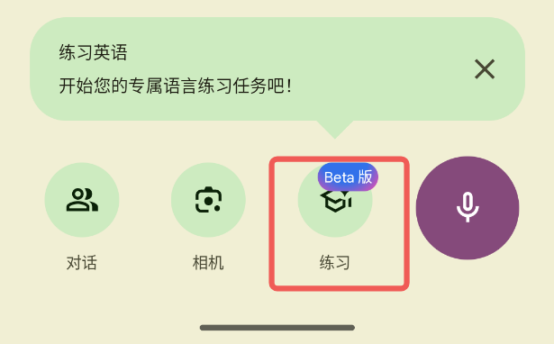

# Google Translate Practice Mode HACK (LSPosed Module)

This module is used to hack the Google Translate app to enable practice mode.

**ONLY FOR EDUCATIONAL PURPOSES!**

**Target App:**
*   **Package Name:** `com.google.android.apps.translate` https://www.apkmirror.com/apk/google-inc/translate/
*   **Tested Version:** `10.1.35.855527520.1-release`

## Installation

1.  Build the project using Android Studio or `./gradlew assembleDebug`.
2.  Install the generated APK (`app/build/outputs/apk/debug/app-debug.apk`) on your device.
3.  Open **LSPosed Manager**.
4.  Enable **AI Translate Hook**.
5.  Ensure **Google Translate** is selected in the scope.
6.  Force stop **Google Translate** to apply changes.

## Development

*   **Language:** Kotlin
*   **Build System:** Gradle (Kotlin DSL)
*   **Minimum SDK:** 26 (Android 8.0)
*   **Target SDK:** 34 (Android 14)
